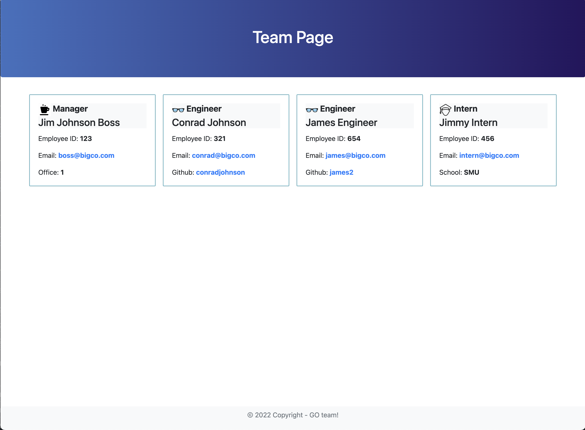

 
 

# Team Profile HTML Generator

## Description

A tool that allows a business owner to generate a team page for their company.  Allows business owner to enter team positions, names and information about each teammate.  Unit tests cover employee, manager, engineer and intern classes.  Recursive function call inspired by this post: http://www.penandpaperprogrammer.com/blog/2018/12/16/repeating-questions-with-inquirerjs. 

## Table of Contents

- [Demo and Screen Shots](#demo)
- [Installation](#installation)
- [Usage](#usage)
- [Testing](#testing)
- [Credits](#credits)
- [License](#license)
- [Questions](#questions)

## Demo
***

Demo:

Screen Shot:

## Installation
***

clone repository and run 'npm i' to install the required inquirer and jest packages.

## Usage
***

For test results, run 'npm run test'.  For generating html team page run 'node index.js'.  HTML page with assets and styling will generate in the 'dist' directory. 

## Testing
***

'npm run test'

## Credits
 ***

[conradjohnson](https://github.com/conradjohnson)

 ## License
 ***

  ISC License

  [https://opensource.org/licenses/ISC](https://opensource.org/licenses/ISC)
  
  Permission to use, copy, modify, and/or distribute this software for any
  purpose with or without fee is hereby granted, provided that the above
  copyright notice and this permission notice appear in all copies.
  
  THE SOFTWARE IS PROVIDED "AS IS" AND THE AUTHOR DISCLAIMS ALL WARRANTIES WITH
  REGARD TO THIS SOFTWARE INCLUDING ALL IMPLIED WARRANTIES OF MERCHANTABILITY
  AND FITNESS. IN NO EVENT SHALL THE AUTHOR BE LIABLE FOR ANY SPECIAL, DIRECT,
  INDIRECT, OR CONSEQUENTIAL DAMAGES OR ANY DAMAGES WHATSOEVER RESULTING FROM
  LOSS OF USE, DATA OR PROFITS, WHETHER IN AN ACTION OF CONTRACT, NEGLIGENCE OR
  OTHER TORTIOUS ACTION, ARISING OUT OF OR IN CONNECTION WITH THE USE OR
  PERFORMANCE OF THIS SOFTWARE.
  
  Copyright (c) 2022 James Johnson
          

# Questions
***
For questions or assistance, please contact through [GitHub Account](https://github.com/conradjohnson) or email: [skaterjames@gmail.com](mailto:skaterjames@gmail.com)

 [Back to top](#description)
